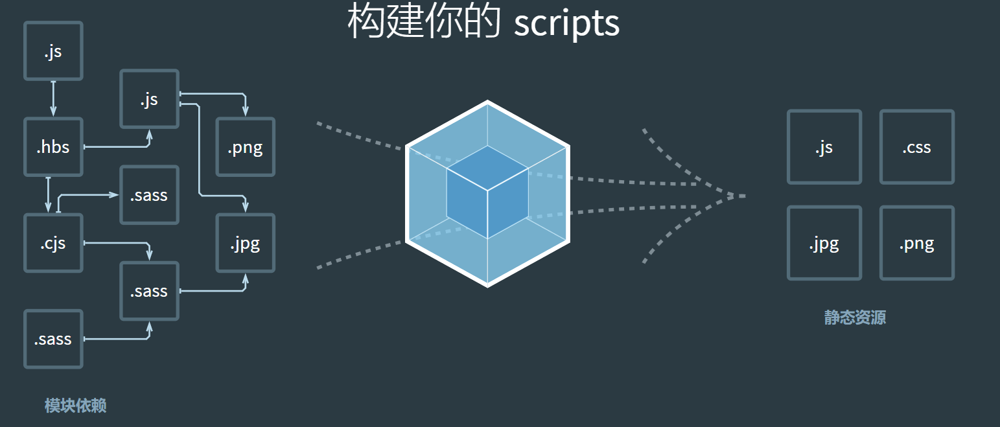

#  1.webpack的基础知识

[webpack官网](https://webpack.docschina.org/)

* 现代 javascript 应用程序的 **静态模块打包器 (module bundler)**
* 打包bundler：webpack可以将帮助我们进行打包，所以它是一个打包工具 
* 静态的static：这样表述的原因是我们最终可以将代码打包成最终的静态资源（部署到静态服务器）； 
* 模块化module：webpack默认支持各种模块化开发，ES Module、CommonJS、AMD等；

> ## ==webpack能做什么==

把很多文件打包整合到一起, 缩小项目体积, 提高加载速度

其中功能:

* less/sass -> css

* ES6/7/8 -> ES5

* html/css/js -> 压缩合并

* 资源文件img、font： 

  - 图片img文件的加载； 

  - 字体font文件的加载；

- HTML资源的处理： 

  - 打包HTML资源文件； 

- 处理vue项目的SFC文件.vue文件；