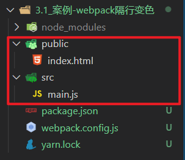
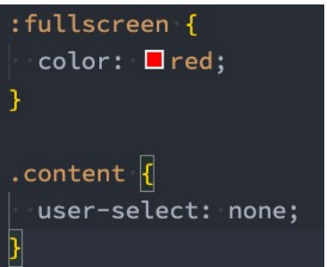
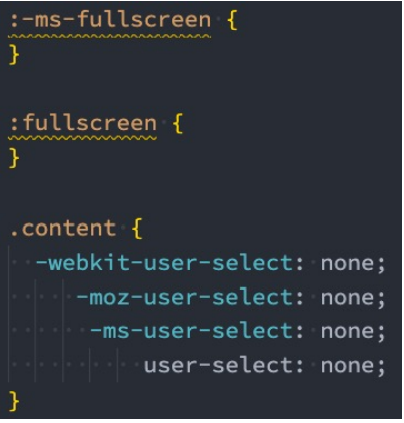
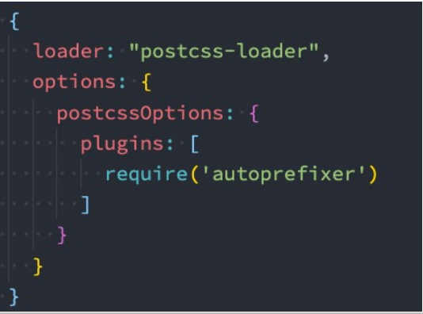

# 3. webpack的配置

##  3.0_webpack-入口和出口

> 目标: 告诉webpack从哪开始打包, 打包后输出到哪里

默认入口: ./src/index.js

默认出口: ./dist/main.js

webpack配置 - webpack.config.js(默认)

1. 新建src并列处, webpack.config.js
2. 填入配置项

```js
const path = require("path")

module.exports = {
    entry: "./src/main.js", // 入口
    output: { 
        path: path.join(__dirname, "dist"), // 出口路径
        filename: "bundle.js" // 出口文件名
    }
}
```

3. 修改package.json, 自定义打包命令 - 让webpack使用配置文件

```json
"scripts": {
    "build": "webpack"
},
```

4. 打包观察效果

## 3.1_打包流程图


==重点: 所有要被打包的资源都要跟入口产生直接/间接的引用关系==

## 3.2_案例-webpack隔行变色

> 目标: 工程化模块化开发前端项目, webpack会对ES6模块化处理

1. 回顾从0准备环境

   * 初始化包环境
   * 下载依赖包
   * 配置自定义打包命令

2. 下载jquery, 新建public/index.html

   ```bash
   yarn add jquery
   ```

   

   

3. index.html 准备一些li

   * ==因为import语法浏览器支持性不好, 需要被webpack转换后, 再使用JS代码==

   ```html
   <!DOCTYPE html>
   <html lang="en">
   <head>
     <meta charset="UTF-8">
     <meta name="viewport" content="width=device-width, initial-scale=1.0">
     <meta http-equiv="X-UA-Compatible" content="ie=edge">
     <title>Document</title>
   </head>
   <body>
   
   <div id="app">
     <!-- ul>li{我是第$个li}*10 -->
     <ul>
       <li>我是第1个li</li>
       <li>我是第2个li</li>
       <li>我是第3个li</li>
       <li>我是第4个li</li>
       <li>我是第5个li</li>
       <li>我是第6个li</li>
       <li>我是第7个li</li>
       <li>我是第8个li</li>
       <li>我是第9个li</li>
     </ul>
   </div>
   
   </body>
   </html>
   ```

4. 在src/main.js引入jquery

   ```bash
   yarn add jquery
   ```

5. src/main.js中编写隔行变色代码

   ```js
   // 引入jquery
   import $ from 'jquery'
   $(function() {
     $('#app li:nth-child(odd)').css('color', 'red')
     $('#app li:nth-child(even)').css('color', 'green')
   })
   ```

6. 执行打包命令观察效果

7. 可以在dist下把public/index.html引入过来

   

   在index.html中==手动==引入js

   ```vue
   <script src="../dist/bundle.js"></script>
   ```

> 总结: 前端工程化模块化, 需要的包yarn下, 被webpack打包后引入到html中使用

## 3.3_插件-自动生成html文件

> 目标: html-webpack-plugin插件, 让webpack打包后生成html文件并自动引入打包后的js

[html-webpack-plugin插件地址](https://www.webpackjs.com/plugins/html-webpack-plugin/)

  1. 下载插件

     ```
     yarn add html-webpack-plugin  -D
     ```

  2. webpack.config.js配置

     ```js
     // 引入自动生成 html 的插件
     const HtmlWebpackPlugin = require('html-webpack-plugin')
     
     module.exports = {
         // ...省略其他代码
         plugins: [
             new HtmlWebpackPlugin({
                 template: './public/index.html' // 以此为基准生成打包后html文件
             })
         ]
     }
     ```

3. 重新打包后观察dist下是否多出html并运行看效果

   ==打包后的index.html自动引入打包后的js文件==

> 总结: webpack就像一个人, webpack.config.js是人物属性, 给它穿什么装备它就干什么活

## 3.4_加载器 - 处理css文件问题

> 目标: 自己准备css文件, 引入到webpack入口, 测试webpack是否能打包css文件

1.新建 - src/css/index.css

2.编写去除li圆点样式代码

3.(重要) 一定要引入到入口才会被webpack打包

4.执行打包命令观察效果

> 总结: 保存原因, 因为webpack默认只能处理js类型文件

## 3.5_加载器 - 处理css文件

> 目标: loaders加载器, 可让webpack处理其他类型的文件, 打包到js中

原因: webpack默认只认识 js 文件和 json文件

[style-loader文档](https://webpack.docschina.org/loaders/style-loader/)

[css-loader文档](https://webpack.docschina.org/loaders/css-loader/)

1. 安装依赖

   ```
   yarn add style-loader css-loader -D
   ```

2. webpack.config.js 配置

   ```js
   const HtmlWebpackPlugin = require('html-webpack-plugin')
   
   module.exports = {
       // ...其他代码
       module: { 
           rules: [ // loader的规则
             {
               test: /\.css$/, // 匹配所有的css文件
               // use数组里从右向左运行
               // 先用 css-loader 让webpack能够识别 css 文件的内容并打包
               // 再用 style-loader 将样式, 把css插入到dom中
               use: [ "style-loader", "css-loader"]
             }
           ]
       }
   }
   ```

3. 新建src/css/li.css - 去掉li默认样式

   ```css
   ul, li{
       list-style: none;
   }
   ```

4. 引入到main.js (因为这里是入口需要产生关系, 才会被找到打包起来)

   ```js
   import "./css/index.css"
   ```

5. 运行打包后dist/index.html观察效果和css引入情况

> 总结: 万物皆模块, 引到入口, 才会被webpack打包, css打包进js中, 然后被嵌入在style标签插入dom上

## 3.6_加载器 - 处理less文件

> 目标: less-loader让webpack处理less文件, less模块翻译less代码

[less-loader文档](https://webpack.docschina.org/loaders/less-loader/)

1. 下载依赖包

   ```bash
   yarn add less less-loader -D
   ```

2. webpack.config.js 配置

   ```js
   module: {
     rules: [ // loader的规则
       // ...省略其他
       {
       	test: /\.less$/,
       	// 使用less-loader, 让webpack处理less文件, 内置还会用less翻译less代码成css内容
           use: [ "style-loader", "css-loader", 'less-loader']
       }
     ]
   }
   ```

3. src/less/index.less  - 设置li字体大小24px

   ```less
   @size:24px;
   
   ul, li{
       font-size: @size
   }
   ```

4. 引入到main.js中

   ```js
   import "./less/index.less"
   ```

5. 打包运行dist/index.html 观察效果

> 总结: 只要找到对应的loader加载器, 就能让webpack处理不同类型文件


## 3.7 PostCss工具

- 什么是PostCSS呢？ 

  - PostCSS是一个通过JavaScript来转换样式的工具； 
  - 这个工具可以帮助我们进行一些CSS的转换和适配，比如自动添加浏览器前缀、css样式的重置； 
  - 但是实现这些功能，我们需要借助于PostCSS对应的插件； 

- 如何使用PostCSS呢？主要就是两个步骤： 

  - 第一步：查找PostCSS在构建工具中的扩展，比如webpack中的postcss-loader； 

  - 第二步：选择可以添加你需要的PostCSS相关的插件；

### 3.7.0 命令行使用PostCss

- 当然，我们能不能也直接在终端使用PostCSS呢？ 

  - 也是可以的，但是我们需要单独安装一个工具postcss-cli； 

- 我们可以安装一下它们：postcss、postcss-cli

  ```bash
  npm install postcss postcss-cli -D
  ```

   

- 我们编写一个需要添加前缀的css： 

  - https://autoprefixer.github.io/ 

  - 我们可以在上面的网站中查询一些添加css属性的样式；

    

### 3.7.1  插件autoprefixer

- 因为我们需要添加前缀，所以要安装autoprefixer：

  ```bash
  yarn add autoprefixer -D
  ```

   

- 直接使用使用postcss工具，并且制定使用autoprefixer 

  ```bash
   npx postcss --use autoprefixer -o end.css ./src/css/style.css
  ```

  

- 转化之后的css样式如下： 

  


### 3.7.2 postcss-loader 

- 真实开发中我们必然不会直接使用命令行工具来对css进行处理，而是可以借助于构建工具： 

  - 在webpack中使用postcss就是使用postcss-loader来处理的； 

- 我们来安装postcss-loader：

  - ```bash
    yarn add postcss-loader -D
    ```

    

- 我们修改加载css的loader：（配置文件已经过多，给出一部分了） 

  - 注意：因为postcss需要有对应的插件才会起效果，所以我们需要配置它的- plugin；
  - 


**单独的PostCss配置文件**

- 当然，我们也可以将这些配置信息放到一个单独的文件中进行管理： 
- 在根目录下创建postcss.config.js

## 3.8 加载器 - 处理图片文件

> 目标: 用asset module方式(webpack5版本新增)

[asset module文档](https://webpack.docschina.org/guides/asset-modules/)

**认识asset module type**

- 我们当前使用的webpack版本是webpack5： 

  - 在webpack5之前，加载这些资源我们需要使用一些loader，比如raw-loader 、url-loader、file-loader； 

  - 在webpack5开始，我们可以直接使用资源模块类型（asset module type），来替代上面的这些loader； 

- 资源模块类型(asset module type)，通过添加 4 种新的模块类型，来替换所有这些 loader： 

  - asset/resource 发送一个单独的文件并导出 URL。之前通过使用 file-loader 实现； 

  - asset/inline 导出一个资源的 data URI。之前通过使用 url-loader 实现； 

  - asset/source 导出资源的源代码。之前通过使用 raw-loader 实现； 

  - asset 在导出一个 data URI 和发送一个单独的文件之间自动选择。之前通过使用 url-loader，并且配置资源体 积限制实现；


如果使用的是webpack5版本的, 直接配置在webpack.config.js - 的 rules里即可

```js
{
    test: /\.(png|jpg|gif|jpeg)$/i,
    type: 'asset'
}
```

如果你用的是webpack4及以前的, 请使用者里的配置

[url-loader文档](https://webpack.docschina.org/loaders/url-loader/)

[file-loader文档](https://webpack.docschina.org/loaders/file-loader/)

1. 下载依赖包

   ```bash
   yarn add url-loader file-loader -D
   ```

2. webpack.config.js 配置

   ```js
   {
     test: /\.(png|jpg|gif|jpeg)$/i,
     use: [
       {
         loader: 'url-loader', // 匹配文件, 尝试转base64字符串打包到js中
         // 配置limit, 超过8k, 不转, file-loader复制, 随机名, 输出文件
         options: {
           limit: 8 * 1024,
         },
       },
     ],
   }
   ```

   图片转成 base64 字符串

   - 好处就是浏览器不用发请求了，直接可以读取
   - 坏处就是如果图片太大，再转`base64`就会让图片的体积增大 30% 左右

3. src/assets/2个图文件

4. 在css/less/index.less - 把小图片用做背景图

   ```less
   body{
       background: url(../assets/logo_small.png) no-repeat center;
   }
   ```

5. 在src/main.js - 把大图插入到创建的img标签上, 添加body上显示

   ```js
   // 引入图片-使用
   import imgUrl from './assets/1.gif'
   const theImg = document.createElement("img")
   theImg.src = imgUrl
   document.body.appendChild(theImg)
   ```


> 总结:  url-loader 把文件转base64 打包进js中, 会有30%的增大, file-loader 把文件直接复制输出

## 3.9 webpack加载文件优缺点

图片转成 base64 字符串

- 好处就是浏览器不用发请求了，直接可以读取
- 坏处就是如果图片太大，再转`base64`就会让图片的体积增大 30% 左右

## 3.10 加载器 - 处理字体文件

> 目标: 用asset module技术, asset/resource直接输出到dist目录下

webpack5使用这个配置

```js
{ // webpack5默认内部不认识这些文件, 所以当做静态资源直接输出即可
    test: /\.(eot|svg|ttf|woff|woff2)$/,
    type: 'asset/resource',
    generator: {
    	filename: 'font/[name].[hash:6][ext]'
    }
}
```

webpack4及以前使用下面的配置

1. webpack.config.js - 准备配置

   ```js
    { // 处理字体图标的解析
        test: /\.(eot|svg|ttf|woff|woff2)$/,
            use: [
                {
                    loader: 'url-loader',
                    options: {
                        limit: 2 * 1024,
                        // 配置输出的文件名
                        name: '[name].[ext]',
                        // 配置输出的文件目录
                        outputPath: "fonts/"
                    }
                }
            ]
    }
   ```

2. src/assets/ - 放入字体库fonts文件夹

3. 在main.js引入iconfont.css

   ```js
   // 引入字体图标文件
   import './assets/fonts/iconfont.css'
   ```

4. 在public/index.html使用字体图标样式

   ```html
   <i class="iconfont icon-weixin"></i>
   ```

5. 执行打包命令-观察打包后网页效果

> 总结: url-loader和file-loader 可以打包静态资源文件

## 3.11 加载器 - 处理高版本js语法

> 目标: 让webpack对高版本 的js代码, 降级处理后打包

写代码演示: 高版本的js代码(箭头函数), 打包后, 直接原封不动打入了js文件中, 遇到一些低版本的浏览器就会报错

原因: **webpack 默认仅内置了 模块化的 兼容性处理**   `import  export`

babel 的介绍 => 用于处理高版本 js语法 的兼容性  [babel官网](https://www.babeljs.cn/)

解决: 让webpack配合babel-loader 对js语法做处理

[babel-loader文档](https://webpack.docschina.org/loaders/babel-loader/)

  1. 安装包

     ```bash
     yarn add -D babel-loader @babel/core @babel/preset-env
     ```

  2. 配置规则

     ```js
     module: {
       rules: [
         {
             test: /\.js$/,
             exclude: /(node_modules|bower_components)/,
             use: {
                 loader: 'babel-loader',
                 options: {
                     presets: ['@babel/preset-env'] // 预设:转码规则(用bable开发环境本来预设的)
                 }
             }
         }
       ]
     }
     ```

3. 在main.js中使用箭头函数(高版本js)

   ```js
   // 高级语法
   const fn = () => {
     console.log("你好babel");
   }
   console.log(fn) // 这里必须打印不能调用/不使用, 不然webpack会精简成一句打印不要函数了/不会编译未使用的代码
   // 没有babel集成时, 原样直接打包进lib/bundle.js
   // 有babel集成时, 会翻译成普通函数打包进lib/bundle.js
   ```

4. 打包后观察lib/bundle.js - 被转成成普通函数使用了 - 这就是babel降级翻译的功能

> 总结: babel-loader 可以让webpack 对高版本js语法做降级处理后打包