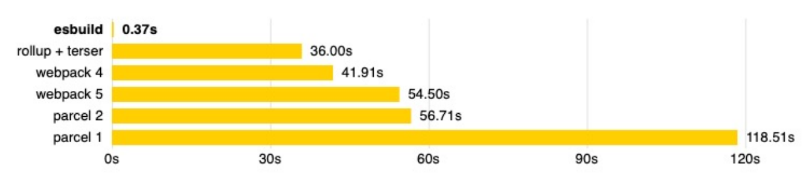

# 5.ESBuild

- ESBuild的特点： 
  - 超快的构建速度，并且不需要缓存； 支持ES6和CommonJS的模块化； 
  - 支持ES6的Tree Shaking； 
  - 支持Go、JavaScript的API； 
  - 支持TypeScript、JSX等语法编译； 
  - 支持SourceMap； 
  - 支持代码压缩； 
  - 支持扩展其他插件；
- ESBuild的构建速度:
  - ESBuild的构建速度和其他构建工具速度对比：
  - 
  - ESBuild为什么这么快呢？
    - **使用Go语言编写的，可以直接转换成机器代码，而无需经过字节码；** 
    - ESBuild可以充分利用CPU的多内核，尽可能让它们饱和运行； 
    - ESBuild的所有内容都是从零开始编写的，而不是使用第三方，所以从一开始就可以考虑各种性能问题；
